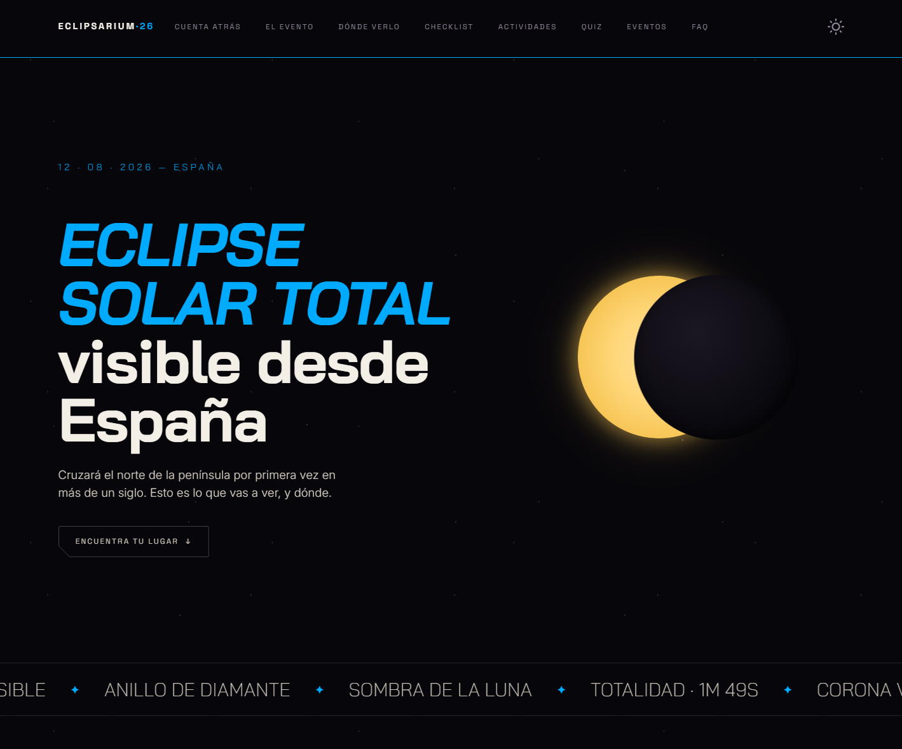

<p align="center">
  
</p>

<p align="center">
  <strong>Informational website about the total solar eclipse on August 12, 2026</strong>
  <br>
  <em>Spain's first total solar eclipse in over a century.</em>
</p>

<p align="center">
  <a href="https://eclipsarium.vercel.app/">🌐 eclipsarium.vercel.app</a>
  ·
  <a href="#features">Features</a>
  ·
  <a href="#stack">Stack</a>
  ·
  <a href="#testing">Testing</a>
  ·
  <a href="CHANGELOG.md">Changelog</a>
</p>

<p align="center">
  
  
  
  
  
</p>

<p align="center">
  🌐 <strong>Site in Spanish</strong> — content is aimed at Spanish-speaking audiences.
  <a href="README-es.md">Leer en español →</a>
</p>

---

<a id="features"></a>

## ✨ Features

|     |                                                                                                                                                                 |
| --- | --------------------------------------------------------------------------------------------------------------------------------------------------------------- |
| 🌑  | **Eclipse animation** — Sun, Moon, umbra, partial → total phases. CSS-driven, respects `prefers-reduced-motion`.                                                |
| 🗺️  | **Interactive map** — Leaflet + CartoDB tiles. NASA/JPL polygon (83 pts). 29 locations, 3 categories (total/edge/partial). Hover popups + click to detail page. |
| 🔍  | **Location search** — JS client-side filter + Nominatim geocoding (2-phase: worldwide settlements → Spain streets). Ray-casting point-in-polygon.               |
| 📅  | **Calendar integration** — Google Calendar, Apple Calendar (webcal with 3 alarms), Outlook, `.ics` download.                                                    |
| ✅  | **Preparation checklist** — 14 items with localStorage persistence, progress bar, 3-column recommendations, safety warnings.                                    |
| 👨‍👩‍👧‍👦  | **Family activities** — 6 hands-on activities with materials, steps, science explanations. Kids quiz (5 V/F questions).                                         |
| ❓  | **General knowledge quiz** — 12 V/F questions across 4 categories (Eclipses, Solar System, Myths, Curiosities). Score + best record via localStorage.           |
| 🌗  | **Dark/light theme** — Animated sun/moon toggle. Persists in localStorage. Respects `prefers-color-scheme`. Map tiles swap via MutationObserver.                |
| 📰  | **Upcoming events** — Fetched from external API at build time. Fallback JSON if API unavailable.                                                                |
| 💬  | **FAQ + myth-busting** — 10 real questions + 6 debunked myths. `<details>` accordion, sourced from NASA/ESA.                                                    |
| ♿  | **Accessible** — axe-core: 0 critical violations. Semantic HTML, `aria-live` regions, `prefers-reduced-motion`.                                                 |
| 📱  | **Responsive** — Mobile-first, works from 360px.                                                                                                                |

Full changelog → [`CHANGELOG.md`](CHANGELOG.md)

---

<a id="stack"></a>

## 🛠️ Stack

| Layer      | Technology                                                                                                        |
| ---------- | ----------------------------------------------------------------------------------------------------------------- |
| Framework  | [Astro](https://astro.build/) `^6.4.2` — static site generation, island architecture                              |
| Map        | [Leaflet](https://leafletjs.com/) `^1.9.4` + CartoDB tiles (dark_all / light_all)                                 |
| Geocoding  | [Nominatim](https://nominatim.org/) — 2-phase worldwide + Spain                                                   |
| CSS        | Custom properties (design tokens), scoped styles per component                                                    |
| Language   | [TypeScript](https://www.typescriptlang.org/) — types in frontmatter `.astro`, vanilla scripts, tests             |
| Unit tests | [Vitest](https://vitest.dev/) `^4.1.9` — 87 tests, 13 suites                                                      |
| E2E + a11y | [Playwright](https://playwright.dev/) `^1.61.0` + [axe-core](https://www.deque.com/axe/) — 92 tests, 9 spec files |
| Runtime    | Node `>=22.13.0` · pnpm                                                                                           |

---

## 🚀 Quick start

```bash
pnpm install
pnpm dev              # http://localhost:4321
pnpm build            # static output → dist/
pnpm preview          # serve built output
pnpm test             # unit tests (Vitest)
pnpm test:e2e         # E2E tests (Playwright)
pnpm test:c           # unit tests with coverage
```

---

## 📁 Structure

```
src/
├── __tests__/              # page-level unit tests
├── components/             # Astro components
│   ├── AddToCalendar.astro # calendar buttons (Google, Outlook, .ics)
│   ├── EclipseMap.astro    # Leaflet map with polygon + markers
│   ├── EventList.astro     # external events API + fallback JSON
│   ├── FaqMyths.astro      # FAQ + myths accordion
│   ├── KidsActivities.astro# family activities + kids quiz
│   ├── PrepChecklist.astro # interactive checklist with persistence
│   ├── QuizGeneral.astro   # general knowledge quiz (12 V/F)
│   └── WhereToWatch.astro  # location list + search + map
├── data/                   # static JSON + co-located tests
│   ├── activities.json
│   ├── event.json
│   ├── events-fallback.json
│   ├── faq.json
│   ├── locations.json
│   └── quiz.json
├── layouts/
│   └── Layout.astro        # base layout, anti-flash script, meta
├── pages/
│   ├── index.astro         # single-page home
│   └── location/[slug].astro # 29 detail pages
├── styles/
│   └── tokens.css          # design tokens (colors, typography, spacing)
test/
└── e2e/                    # Playwright test files
```

**Pattern:** tests are co-located with their source — each `.astro` component has a `.test.ts` next to it. Same for JSON data files.

---

<a id="testing"></a>

## 🧪 Testing

Three layers, all runnable without external services:

| Layer         | Tool       | Count                   | Scope                                                             |
| ------------- | ---------- | ----------------------- | ----------------------------------------------------------------- |
| Unit          | Vitest     | 87 tests / 13 suites    | Component rendering, data structure validation, fallback coverage |
| E2E           | Playwright | 92 tests / 9 spec files | Navigation, interactivity, scroll, quiz flow, search              |
| Accessibility | axe-core   | Integrated in E2E       | 0 critical violations across all key sections                     |

**Key practices:**

- Components tested via `AstroContainer.renderToString()` — no browser needed for unit tests
- Data files validated: schema, required fields, uniqueness
- External API mocked via `vi.stubGlobal` — tests never hit real endpoints
- E2E tests run on both Chromium and mobile viewport
- CI-ready: `pnpm test && pnpm test:e2e`

---

## 🏗️ Architecture

### Static-first

Built as a fully static site (Astro SSG). Zero server runtime. Data fetched at build time via Astro frontmatter. This means:

- **Fast:** pre-rendered HTML, no JS waterfall
- **Cheap:** can deploy to any static host (Vercel, Netlify, GitHub Pages)
- **Resilient:** external API failures don't break the site — fallback JSON files ship with the build

### Component pattern

Each feature is a self-contained Astro component:

```
component.astro
├── frontmatter   → import data, render HTML
├── template      → semantic HTML with scoped CSS classes
├── <script>      → vanilla JS for interactivity (no framework)
└── <style>       → scoped CSS, design tokens via var()
```

No React, no Vue, no client JS framework. Just Astro + vanilla JS where needed. This keeps the bundle tiny and the mental model simple.

### Design tokens

All visual properties defined as CSS custom properties in `tokens.css`:

```css
--space-blue: #4a9eff;
--bone: #e8e6e3;
--font-accent: 'Instrument Serif', serif;
--step-0: clamp(1rem, 0.9vw + 0.5rem, 1.25rem);
```

Components reference these variables — never hardcode colors or sizes. The `[data-theme="light"]` selector swaps the palette for light mode.

### Data isolation

Content lives in `src/data/*.json`. Components import and render it. Editing copy never requires touching component code. External data (events API) has a local JSON fallback that ships with every build.

### State management

All client state uses `localStorage` — no global state library. Keys are namespaced per feature:

- `eclipsarium-checklist`
- `eclipsarium-quiz-best`
- `eclipsarium-quiz-general-best`
- `theme`

### JS scoping

Components sharing the DOM use unique data attributes for their JS selectors (`data-quiz-general` vs `data-quiz`) to avoid collisions when multiple instances coexist on the same page.

---

## 📊 Quality

| Metric               | Status                                          |
| -------------------- | ----------------------------------------------- |
| Lighthouse (desktop) | 94 / 94 / 100 / 100                             |
| Lighthouse (mobile)  | 73 / 94 / 100 / 100                             |
| axe-core             | 0 critical violations                           |
| Responsive           | Works from 360px to 4K                          |
| Theme                | Dark (default) + Light with animated toggle     |
| Build                | 30 static pages, 0 errors                       |
| Motion               | All animations respect `prefers-reduced-motion` |

---

## 🤝 Contributing

1. Fork and clone.
2. `pnpm install`
3. Create a branch: `feat/your-feature` or `fix/your-bug`
4. Write tests first (data validation for JSON changes, component render for UI).
5. Ensure `pnpm test && pnpm test:e2e` passes.
6. Open a PR with a clear description.

**Conventions:**

- ESLint + Prettier via `prettier-plugin-astro`
- Conventional commits: `feat:`, `fix:`, `test:`, `refactor:`
- Tests co-located with source files
- Data in JSON, never hardcoded

---

## 📄 License

[MIT](LICENSE) © 2026 Edu Yeves
